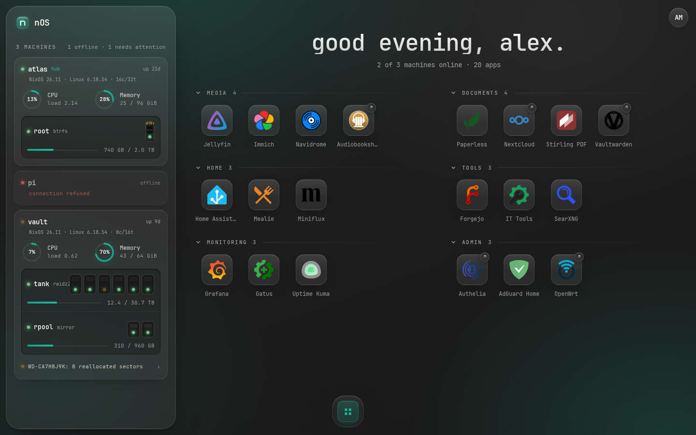
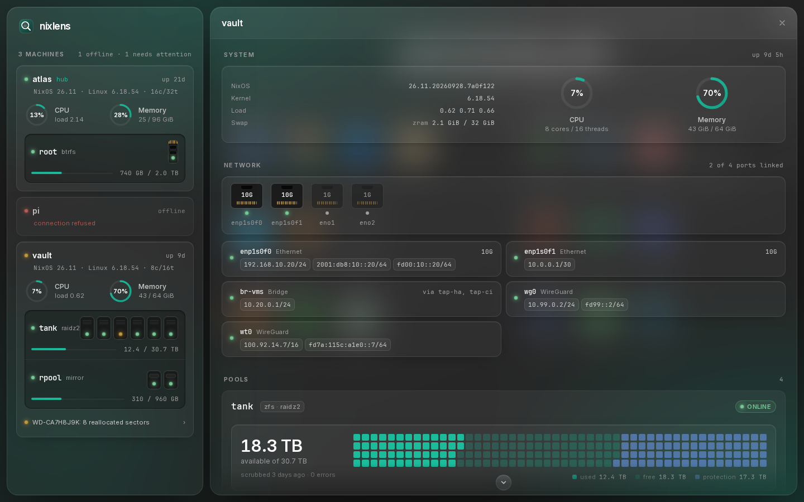
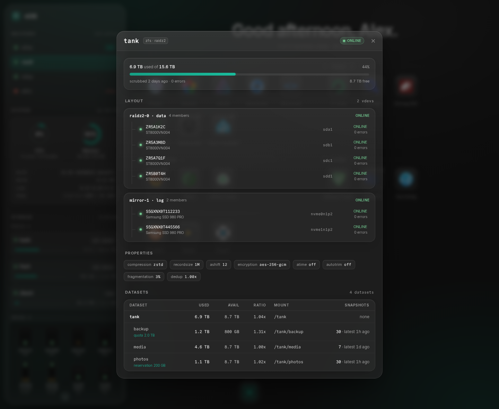
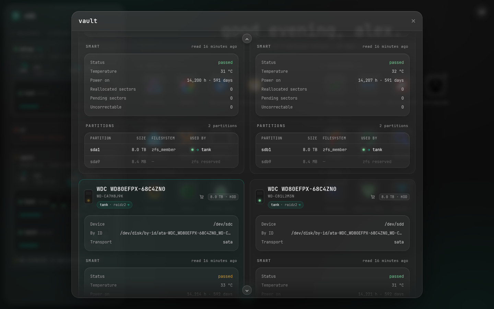
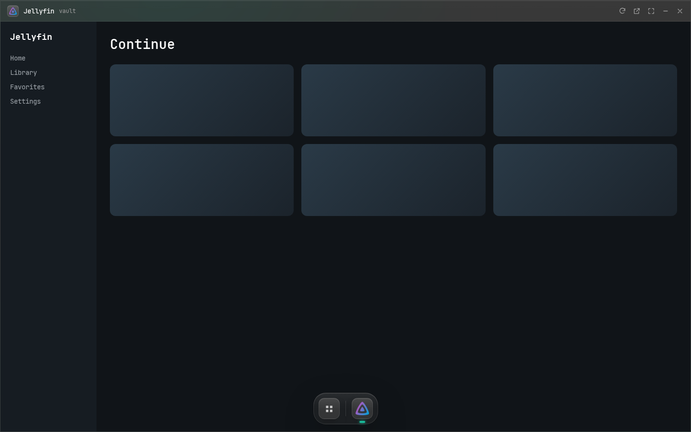
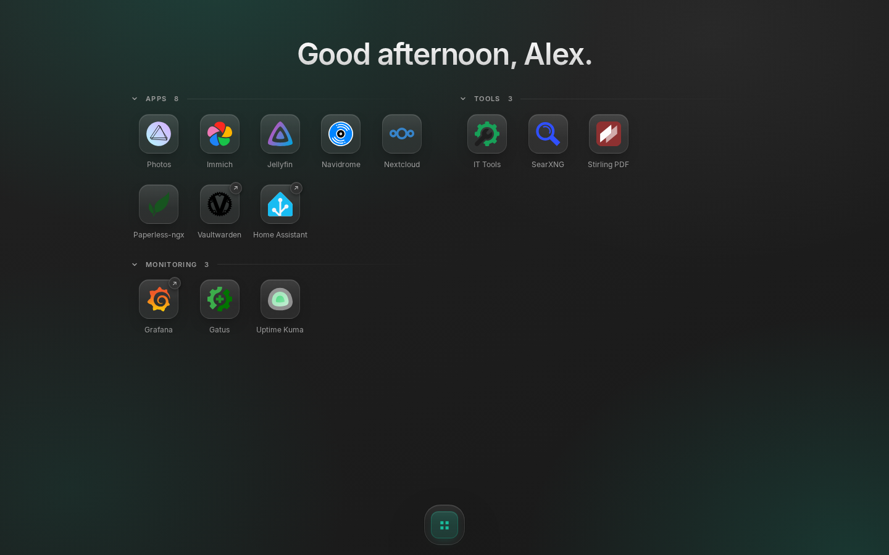
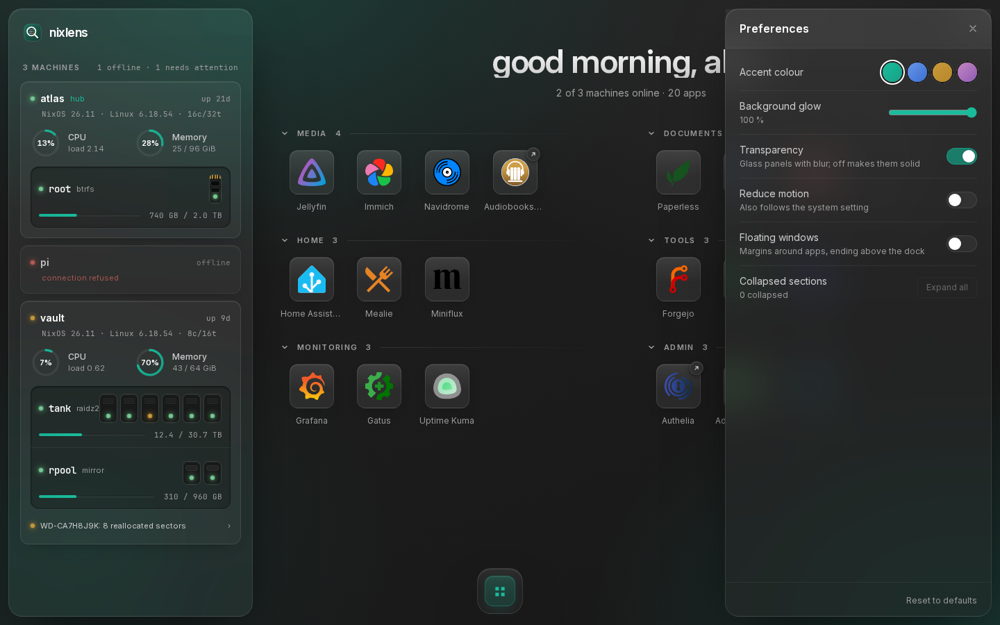
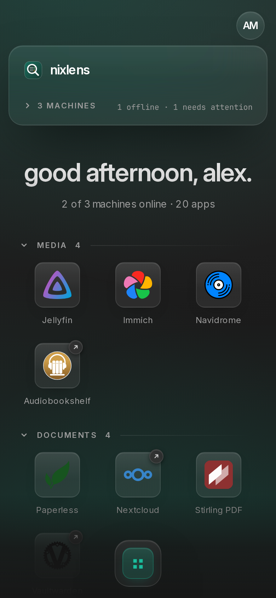
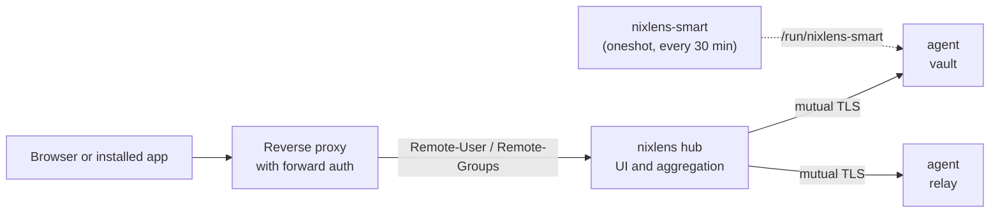

<!-- prettier-ignore -->
<div align="center">


# nixlens

**A visual overview of your NixOS machines: what runs where, on which drives and networks, at a glance, with your apps one click away.**

[](#getting-started)
[](./go.mod)
[](./web/package.json)
[](LICENSE)

[Features](#features) • [Screenshots](#screenshots) • [How it works](#how-it-works) • [Getting started](#getting-started) • [Configuration](#configuration) • [Security](#security) • [Development](#development)



</div>

> [!WARNING]
> nixlens is in alpha and a work in progress. Options, the agent API and the UI may change without notice, and things may break between commits.

NixOS describes your systems, but it doesn't show them. Everything sits in `.nix` files, spread across modules, machines and clan roles. It's all declared, but you can't see it anywhere. Which interface has which IP, which filesystem runs where, how many drives sit in which pool, which app runs on which machine: you'd have to look it up across the code or SSH in to find out.

nixlens is the view onto it: what's actually there and running, at a glance, read-only. It feels like the home screen of a NAS system such as umbrelOS or ZimaOS, but it manages nothing; your configuration already does that. nixlens only makes it visible, and opens your apps.

> [!NOTE]
> nixlens shows live state only. It keeps no history, draws no charts and sends no alerts. Pair it with a monitoring tool if you need those.

## Features

- **App home screen.** Apps declared in Nix, grouped into collapsible categories, with icons from [dashboard-icons](https://github.com/homarr-labs/dashboard-icons), [selfh.st](https://selfh.st/icons/) or [Material Design Icons](https://pictogrammers.com/library/mdi/).
- **App windows and a dock.** Apps open inside nixlens and stay alive in the background, so switching is instant. Windows float or maximize above the dock. Apps that forbid framing are detected from their headers and open in a new tab instead.
- **Machines at a glance.** A sidebar card per machine with CPU and memory rings, uptime, NixOS release and kernel, every pool with its drives, and anything that needs a look. Offline machines say why.
- **Everything about a machine on one page.** System, network, every pool and every drive in one popup. A pool or drive clicked in the sidebar is scrolled to and marked. Every view has an address, so back, reload and bookmarks work, also with the back gesture of an installed app.
- **Storage that makes sense.** ZFS and md pools, btrfs, ext4 and other file systems. Capacity is drawn over the raw space of the drives, so you see what redundancy takes, and each vdev shows how many failures it survives. Datasets with quotas and snapshots, partition tables, and a link to look up a replacement drive on geizhals.de.
- **SMART without waking drives.** Health, temperature, wear and sector counts, collected by a separate privileged oneshot that never spins up a sleeping disk.
- **Network.** Ethernet ports with their link and the speed they support, and every connection with its addresses: bonds, bridges, WireGuard and other tunnels. Click an address to copy it.
- **Multi-machine.** One hub aggregates any number of agents over mutual TLS.
- **Groups from your SSO.** Behind a forward-auth proxy, admins see machines and storage while everyone else gets the app grid.
- **Read-only and small.** Agents never write to the system, run unprivileged under strict systemd hardening and do no work while nobody is looking.
- **Installable.** A web app manifest lets phones and desktops install nixlens as an app.

## Screenshots

| Machine details                                                                             | Pool                                                                                         |
| ------------------------------------------------------------------------------------------- | -------------------------------------------------------------------------------------------- |
|  |    |
| **Drive**                                                                                   | **App window**                                                                               |
|         |          |
| **View for non-admins**                                                                     | **Preferences**                                                                              |
|                      |  |

<details>
<summary>On a phone</summary>



</details>

> [!TIP]
> All screenshots use invented machines, drives and apps.

## How it works



nixlens is one Go binary built from the standard library only, with the React UI embedded:

- **Agent** (every machine): answers `/api/local/*` with system, storage, network and app data. It reads `/proc`, `/sys`, netlink, `lsblk`, `zpool`, `zfs` and `ethtool` on request and keeps no state.
- **Hub** (one machine): serves the UI on loopback behind your reverse proxy, fetches its peers' data server-side and decides per app whether it may be framed. It reads the user's groups from the proxy's `Remote-*` headers.
- **SMART collector**: a separate oneshot with raw disk access writes `/run/nixlens-smart/smart.json`, so the agent itself never needs privileges.

## Getting started

You need NixOS with flakes. Add nixlens as an input and import its module:

```nix
{
  inputs.nixlens = {
    url = "github:fosskar/nixlens";
    inputs.nixpkgs.follows = "nixpkgs";
  };

  outputs = { nixpkgs, nixlens, ... }: {
    nixosConfigurations.atlas = nixpkgs.lib.nixosSystem {
      modules = [
        nixlens.nixosModules.default
        ./configuration.nix
      ];
    };
  };
}
```

### A single machine

The hub also reports its own machine, so one host needs nothing else:

```nix
{
  services.nixlens = {
    enable = true;
    smart.enable = true;
    hub.enable = true;

    apps.Jellyfin = {
      url = "https://jellyfin.example.com";
      icon = "jellyfin.svg";
      category = "Media";
    };
    apps."Home Assistant" = {
      url = "https://home.example.com";
      icon = "home-assistant.svg";
      category = "Home";
    };
  };
}
```

Then put it behind your reverse proxy and its authentication, for example with Caddy and Authelia:

```caddy
nixlens.example.com {
	forward_auth 127.0.0.1:9091 {
		uri /api/authz/forward-auth
		copy_headers Remote-User Remote-Groups Remote-Name Remote-Email
	}
	reverse_proxy 127.0.0.1:7480
}
```

> [!IMPORTANT]
> The hub trusts the `Remote-*` headers of your proxy, so it must listen on loopback. The module enforces this with an assertion.

### Several machines

Every other machine runs an agent. Hub and agents authenticate each other over mutual TLS without a CA: every machine creates its own ed25519 key on first start, and each side trusts the other by the fingerprint of its public key, as with SSH or WireGuard. The private key never leaves the machine, and nothing secret goes into your configuration.

1. Enable nixlens on every machine with its defaults, which listen on loopback only, and deploy once. Each logs its fingerprint on start:

   ```console
   $ journalctl -u nixlens | grep fingerprint
   nixlens[812]: key fingerprint SHA256:kCMYrBc50GUIBasXh+I46P+YP5e5kWUBIUN/iegW9fM
   ```

2. Tell each side about the other:

```nix
# on each agent, e.g. vault
services.nixlens = {
  enable = true;
  smart.enable = true;
  listenAddress = "::";
  openFirewall = true;
  trustedHubs = [ "SHA256:6PYaZQqsy1qpSBCVqlN2BpfrAZGF0QB6k9Chgqo7mM4" ]; # the hub's
};

# on the hub
services.nixlens = {
  enable = true;
  hub.enable = true;
  hub.peers.vault = {
    url = "https://vault.example.lan:7480";
    fingerprint = "SHA256:kCMYrBc50GUIBasXh+I46P+YP5e5kWUBIUN/iegW9fM"; # vault's
  };
};
```

The key lives in `/var/lib/private/nixlens`; keep that directory across reboots, or set `services.nixlens.keyFile` to a key from your secret manager.

### With clan

nixlens ships a [clan](https://clan.lol) service that wires up roles, peers and keys for you. Every machine's key comes from a vars generator, and the service writes each side's fingerprint into the other's configuration.

```nix
inventory.instances.nixlens = {
  module = {
    name = "@fosskar/nixlens";
    input = "nixlens";
  };
  roles.hub.machines.atlas = { };
  roles.agent.machines.vault = { };
  roles.agent.machines.relay = { };
};
```

The hub reaches each agent at `https://<machine>.<meta.domain>:7480`. Run `clan vars generate` before the first deployment.

## Configuration

| Option                                           | Default       | Description                                                                           |
| ------------------------------------------------ | ------------- | ------------------------------------------------------------------------------------- |
| `services.nixlens.enable`                        | `false`       | Run the agent, which reports this machine's state.                                    |
| `services.nixlens.listenAddress`                 | `"127.0.0.1"` | Address to listen on. A hub must stay on loopback.                                    |
| `services.nixlens.port`                          | `7480`        | Port to listen on.                                                                    |
| `services.nixlens.openFirewall`                  | `false`       | Open the port in the firewall.                                                        |
| `services.nixlens.apps.<name>`                   | `{ }`         | Apps on this machine: `url`, `icon`, `category` (default `"Apps"`) and `description`. |
| `services.nixlens.smart.enable`                  | `false`       | Collect SMART health every 30 minutes without waking sleeping drives.                 |
| `services.nixlens.keyFile`                       | `null`        | Key for mutual TLS; created in the state directory when unset.                        |
| `services.nixlens.trustedHubs`                   | `[ ]`         | Fingerprints of the hubs that may read this agent. Required beyond loopback.          |
| `services.nixlens.hub.enable`                    | `false`       | Serve the UI and aggregate this machine with its peers.                               |
| `services.nixlens.hub.peers.<name>`              | `{ }`         | Agents to show, by machine name: `url` and the `fingerprint` of their key.            |
| `services.nixlens.hub.categories`                | `[ ]`         | Categories listed first, in this order; the rest follow alphabetically.               |
| `services.nixlens.hub.adminGroups`               | `[ ]`         | Groups that see machines and storage. Empty allows everyone.                          |
| `services.nixlens.hub.categoryGroups.<category>` | `{ }`         | Groups that see a category. Unlisted categories are visible to all.                   |

An app's `icon` can be a dashboard-icons file or name (`jellyfin.svg`), a selfh.st icon (`sh-jellyfin`, or `sh-convertx.png` for one without an svg), a Material Design icon (`mdi-printer`) or a URL. The hub fetches icons from these sets once, keeps them in `/var/lib/nixlens/icons` and serves them itself, so it needs to reach `cdn.jsdelivr.net` the first time it sees an icon; URLs load directly in the browser.

## Security

- **Read-only agents.** The agent runs as a `DynamicUser` with an empty capability set, a read-only file system, a system call allow-list, closed device access apart from `/dev/zfs`, only the `AF_INET`, `AF_INET6`, `AF_NETLINK` and `AF_UNIX` socket families, and memory and task limits. `systemd-analyze security` rates it 1.5.
- **Privileged parts are isolated.** Reading installed memory from SMBIOS runs once in a privileged `ExecStartPre`. SMART runs in `nixlens-smart.service` with only `CAP_SYS_RAWIO` and `CAP_SYS_ADMIN`, read-only disk access and no network.
- **Transport.** Mutual TLS 1.3 between hub and agents, each pinning the other's key by its fingerprint. Keys are created on the machine or reach the service through `LoadCredential`, and may not live in the Nix store.
- **Browser.** The UI is served with a strict Content Security Policy and `frame-ancestors 'none'`.

> [!IMPORTANT]
> An agent that listens beyond loopback must set `services.nixlens.trustedHubs`; the module refuses the configuration otherwise, since anyone who reaches the port could read the machine's system and storage data.

## Development

```bash
nix develop

# backend
go test ./...
go build -o nixlens ./cmd/nixlens && ./nixlens -hub

# frontend dev server, reloading on change and proxying /api to a hub on 127.0.0.1:7480
cd web && npm install && npm run dev

# two-node NixOS VM test: mTLS, ZFS, SMART, network, groups and apps
nix build .#checks.x86_64-linux.nixos-test
```

The UI is embedded into the binary from `web/dist`, so run `npm run build` before `go build`. `nix build` does both.
